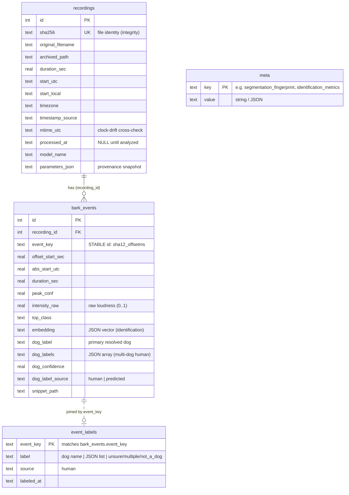

# Bark Detector Offline

Analyze Zoom H6 24/7 MP3 recordings for **dog barking** — to document *when*, *how
much*, *how loud*, and (optionally) *which dog* barks. It produces a JSON results
file plus playable audio clips for a static frontend to present as evidence for a
noise complaint.

Designed for **integrity**: originals are hashed (SHA-256) and copied into an
immutable archive, recording start times come from the SD card's own filesystem
timestamps, every detection has a listenable clip, model parameters are recorded
with each result, and the whole pipeline is reproducible and idempotent.

---

## Table of Contents

- [Overview](#overview)
- [Typical workflow (stage by stage)](#typical-workflow-stage-by-stage)
- [Installation](#installation)
- [Running the pipeline](#running-the-pipeline)
- [How detection works (inference)](#how-detection-works-inference)
- [Training: telling the dogs apart](#training-telling-the-dogs-apart)
- [Labeling (the local label server)](#labeling-the-local-label-server)
- [Publishing and hosting](#publishing-and-hosting)
- [Output and data contract](#output-and-data-contract)
- [Database](#database)
- [Configuration reference](#configuration-reference)
- [Scientific background and references](#scientific-background-and-references)
- [Testing](#testing)
- [Chain of custody](#chain-of-custody)

---

## Overview

The pipeline is a sequence of **steps** listed in `config.yml` (`run.steps`). Each
runs in order and is independently re-runnable:

| Step | What it does |
|------|--------------|
| `ingest` | Read MP3s from the SD card, hash them, derive the recording start time from the card's creation timestamp, copy each into `data/archive/`. |
| `analyze` | Stream each recording through **PANNs** (a pretrained audio-event model), detect bark events, measure per-event loudness, compute a per-event embedding, and cut a playable clip. |
| `identify` | Read human labels from the DB, train a lightweight per-dog classifier, and predict a dog for every event. |
| `serve` | Run the local labeling server (not part of a normal run — invoked as `python -m barkdetect serve`). |
| `export` | Write `data/export/results.json`: events, coverage/gaps, daily summaries, per-dog counts, and provenance. |
| `publish` | Assemble `data/site/` (frontend + results.json + clips) — the single, curated deploy unit. |

Everything is **config-driven**: the program takes no command-line arguments.

---

## Typical workflow (stage by stage)

The tool is used across a few distinct stages. Each links to its detailed section.

### Stage 0 — One-time setup ([Installation](#installation))
1. `mamba env create -f environment.yml` and activate it.
2. Fetch the PANNs checkpoint (see the [checkpoint note](#the-panns-model-checkpoint-one-time-312-mb)).
3. Edit `config.yml`: `run.source`, `paths.root`, `timezone`, and the
   `identification.dogs` roster.

### Stage 1 — Tune segmentation (do this *before* labeling)
Detection boundaries depend on `detection.threshold`, `merge_gap_seconds`,
`min_event_seconds`. For **per-bark** granularity (rapid bursts), those knobs hit
PANNs' resolution limit — use **onset sub-segmentation** (`onset`) instead, which
splits bursts from the raw waveform. Experiment on a small batch and listen. Do it
in a **separate dataset** so your main DB/labels are safe — that's what
`config-fine.yml` is for (its own `paths.root`, `onset.use_onset_detection: true`,
`debug_plots: true`, on port 8001):
```bash
BARKDETECT_CONFIG=config-fine.yml python -m barkdetect          # build the experiment dataset
BARKDETECT_CONFIG=config-fine.yml python -m barkdetect serve    # inspect on http://localhost:8001
#   → check event count jumped, view data/onset_debug/*.png, tune onset.min_interval_seconds / delta
```
Each segmentation change re-segments and (once you have labels) triggers the
[segmentation guard](#the-segmentation-guard). **Lock segmentation before labeling
a lot**, because changing it later orphans labels.

### Stage 2 — Ingest & analyze ([Running](#running-the-pipeline), [How detection works](#how-detection-works-inference))
Plug in the SD card and run the pipeline. New files are copied, analyzed
(bark events + loudness + embeddings), and clips are cut. Already-processed files
are skipped.
```bash
python -m barkdetect            # ingest → analyze → identify → export → publish
```

### Stage 3 — Label the dogs ([Labeling](#labeling-the-local-label-server))
Run the local server and label clips; labels save straight to the database.
```bash
python -m barkdetect serve      # open http://127.0.0.1:8000, turn on training mode
```

### Stage 4 — Train & review ([Training](#training-telling-the-dogs-apart))
Re-run identification to train the per-dog model on your labels and refresh
predictions + the reliability panel, then republish.
```bash
python -m barkdetect            # (or a subset: edit run.steps to [identify, export, publish])
```

### Stage 5 — Publish & share ([Publishing](#publishing-and-hosting))
`publish` builds `data/site/` — the curated, read-only bundle for the lawyer/police.
Serve it locally, or deploy it to an access-controlled host.

### Ongoing — every few days
New recordings arrive → repeat **Stage 2** (and **Stage 3–4** as you label more).
Segmentation stays locked, so labels persist; only new events get added.

> Tweaking **snippet** settings (padding/length/naming) is safe anytime — set
> `run.reprocess: true` once to re-cut clips without losing labels. Only
> **segmentation** changes are guarded.

---

## Installation

Uses conda/mamba because the audio + ML stack (`ffmpeg`, `libsndfile`, PyTorch)
ships as native binaries that are painful via pip on Windows. A reproducible
`environment.yml` is also part of chain-of-custody — any machine can re-verify.

```bash
mamba env create -f environment.yml
mamba activate bark-detector-offline
python -c "import torch, panns_inference, librosa, soundfile, sklearn; print('ok')"
```

`ffmpeg` is installed into the env by conda — no separate install needed.

### The PANNs model checkpoint (one-time, ~312 MB)

On first `analyze`, `panns_inference` downloads its checkpoint. It shells out to
`wget`; if you have an old GnuWin32 `wget` on PATH, its TLS will fail against
zenodo and leave a **truncated/0-byte file**, which later crashes with an opaque
`torch` error. Fetch it manually with a modern downloader instead:

```powershell
curl.exe -L -o "$env:USERPROFILE\panns_data\Cnn14_DecisionLevelMax.pth" `
  "https://zenodo.org/record/3987831/files/Cnn14_DecisionLevelMax_mAP%3D0.385.pth?download=1"
```

The complete file is **327,428,481 bytes**. Verify it loads:
`python -c "import torch; torch.load(r'%USERPROFILE%/panns_data/Cnn14_DecisionLevelMax.pth', map_location='cpu'); print('ok')"`.
On flaky connections use `curl.exe -C -` (resume) in a loop. This is a one-time
step; afterwards the pipeline runs fully offline.

### Configure before first use

Edit `config.yml` — at minimum set `run.source` (recordings folder / SD card),
`paths.root` (where data lives, outside the git repo), `timezone` (must match the
recorder's clock), and the dog roster under `identification.dogs`.

---

## Running the pipeline

```bash
python -m barkdetect
```

That runs whatever is in `run.steps`. For the normal every-few-days operation:

```yaml
run:
  source: "D:/Projects/dog_bark/temp_input"   # recordings only — no other mp3s here
  steps: [ingest, analyze, identify, export, publish]
```

Common variations:

- Only rebuild the JSON/site: `steps: [export, publish]`
- Re-run detection without re-copying: `steps: [analyze, identify, export]`
- Re-run identification after labeling: `steps: [identify, export, publish]`
- Alternate config file: `BARKDETECT_CONFIG=other.yml python -m barkdetect`

Re-running is safe: files already ingested (same SHA-256) are skipped, and only
unprocessed recordings are analyzed. The database auto-migrates (adds new columns)
when you upgrade, so you never need to delete it.

### Logging & progress

Analysis logs each stage with timing and a **realtime factor** (audio processed
per wall-clock second) so remaining time is predictable — e.g. `ZOOM0007.MP3 done
- 128 events in 12m23s (34.8x realtime)` means a 7 h file takes ~12 min. A live
`tqdm` bar shows per-file percentage and ETA. Configure via the `logging` block;
`log_file` doubles as a timestamped processing audit trail.

---

## How detection works (inference)

The `analyze` step is the heavy part. It processes arbitrarily long recordings
(24 h+) on a CPU with **flat memory** and **predictable progress**.

**1. Single-pass streaming decode.** A recording is never loaded whole. `ffmpeg`
decodes the MP3 in one forward pass to mono 32 kHz float32 PCM (PANNs' required
format) and pipes it out; `audio.stream_windows` reads that pipe in fixed
`window_seconds` chunks (default 60 s). RAM stays constant regardless of length.

**2. Per-window normalization.** Each window is peak-normalized before detection
(`audio.normalize_window`): quiet audio is boosted toward `target_peak`, capped by
`max_gain`, with a `noise_floor` guard so near-silence isn't amplified into false
positives. This only feeds detection; loudness is measured separately (step 4).

**3. Model inference (the bottleneck).** Each window runs through the PANNs
`Cnn14_DecisionLevelMax` **Sound Event Detection** model, which returns a
frame-level probability (~100 frames/s) for all 527 AudioSet classes. Per frame we
keep the **max probability across the configured `dog_classes`** and which class
won. See [Scientific background](#scientific-background-and-references).

**4. Timeline assembly, events & loudness.** Per-window frame scores are
concatenated into one continuous timeline. `detect.extract_events` thresholds at
`detection.threshold` (low = high recall), merges hot runs closer than
`merge_gap_seconds`, and drops runs shorter than `min_event_seconds`. Each
survivor becomes one **event**. Because the timeline is continuous, a bark
straddling a window boundary is still one event. In parallel, a raw-loudness
envelope from the **un-normalized** audio is captured on the same timeline; each
event gets its peak loudness → `intensity_relative` (0–1) and `intensity_dbfs`.

*Optional onset sub-segmentation* (`onset.use_onset_detection`): PANNs' score
doesn't dip between rapid barks, so a burst is one region. When enabled, each
region is split at bark **onsets** found in the raw waveform (see `onset`), so a
burst becomes one event per bark — better for per-slice dog identification.
Per-slice features are recomputed from the same frame arrays, so everything
downstream is unchanged, just finer.

**5. Absolute timing, embeddings, snippets, provenance.** Offsets are added to the
recording start for absolute UTC/local times. A per-event **embedding** is computed
for identification (see [Training](#training-telling-the-dogs-apart)). A padded MP3
clip is cut per event (loudness-normalized so faint barks are audible; the archived
original is never modified). The exact parameters used are stored with the
recording.

Latency scales with audio length, not file count. Tuning: raise `window_seconds`
to reduce per-call overhead.

### Where each per-event feature is computed

Raw facts are produced at detection time, absolute/persisted facts at analyze time,
derived/presentational facts at export time (so they can be recomputed without
re-running the model).

```text
  archived MP3
      │
      ▼
┌─────────────────────────────────────────────────────────────────────┐
│ score_recording()                                        detect.py    │
│  stream_windows() ──▶ per 60s window: raw float32 samples             │
│                     ┌─────────────┴──────────────┐                    │
│                     ▼                             ▼                    │
│            normalize_window()             _frame_energy(raw)          │
│            (for detection only)           rms│peak per frame          │
│                     ▼                             ▼                    │
│            model.inference()                                          │
│                     ▼                             ▼                    │
│        ══ dog-class score timeline ══     ══ loudness timeline ══      │
└───────────────────────┬─────────────────────────┬────────────────────┘
                        ▼                          ▼
┌─────────────────────────────────────────────────────────────────────┐
│ extract_events()   threshold ▸ merge ▸ min-duration    detect.py      │
│    offset_start/end_sec, duration_sec              ◀ timeline         │
│    peak_conf, mean_conf, top_class                 ◀ scores           │
│    intensity_raw                                   ◀ loudness         │
└───────────────────────────────┬─────────────────────────────────────┘
                                ▼
┌─────────────────────────────────────────────────────────────────────┐
│ analyze()                                                analyze.py    │
│    + abs_start/end_utc, event_key, embedding, snippet_path            │
│    ▸ persist event row to SQLite                                      │
└───────────────────────────────┬─────────────────────────────────────┘
                                ▼
┌─────────────────────────────────────────────────────────────────────┐
│ identify()  (labels.json → train → predict)             identify.py   │
│    + dog_label, dog_confidence, dog_label_source                      │
└───────────────────────────────┬─────────────────────────────────────┘
                                ▼
┌─────────────────────────────────────────────────────────────────────┐
│ build_export()                                           export.py    │
│    + abs_start_local, night, intensity_relative/dbfs, snippet_url     │
│    aggregates: daily_summary (+by_dog), coverage, gaps                │
└─────────────────────────────────────────────────────────────────────┘
                                ▼
                         results.json
```

---

## Training: telling the dogs apart

Several dogs may be involved, and you may want per-dog counts. This is **individual
identification by voice** — a hard, inherently imperfect problem (see the
[references](#scientific-background-and-references)). The design reflects that:

- **No fine-tuning, no training from scratch.** The detector is reused untouched.
  We add a *separate* identity path: a frozen **embedding** (fingerprint) per bark
  + a **lightweight classifier** trained on a handful of your own labels
  ("few-shot"). This works with dozens of examples, trains in seconds on CPU, and
  the embedding model is swappable without touching anything else.
- **You provide the ground truth.** The residents know the dogs, so labels come
  from listening to clips in the website's *training mode* — the most defensible
  possible source.

### The workflow

1. **Embeddings** — `analyze` computes a per-event embedding (config
   `identification.embedding`, default `librosa`: MFCC + spectral + ZCR features).
   Stored per event; no extra model download.
2. **Label in the website** — run `python -m barkdetect serve`, turn on *training
   mode*, play a clip, and pick the dog(s) from the roster (`identification.dogs`)
   or `Unsure` / `Multiple` / `Not a dog`. Labels are saved **directly to
   `barks.db`** (see [Labeling](#labeling-the-local-label-server)) — no export
   step.
3. **`identify` step** — reads the labels from the DB, trains the classifier once
   there are ≥ `min_labels_per_dog` labels for ≥ 2 dogs, saves the model, and
   predicts a dog for **every** event. Human labels always win; the rest get a
   *predicted* dog + confidence.
4. **Export / publish** — `dog_label`, `dog_confidence`, and `dog_label_source`
   land in `results.json`; the frontend shows *confirmed* vs *suggested* distinctly.

Labels are keyed by a **stable `event_key`** (`<sha12>_<offsetms>`), so they
survive database rebuilds and re-runs.

### Model choice and expectations

- Start with `embedding: librosa` (no download). If dogs don't separate well,
  switch to `embedding: panns` (richer, needs the AudioTagging checkpoint) or
  `embedding: aves` (animal-tuned, new dependency) — **no other code changes**.
- Accuracy is expected to be imperfect (literature ≈ 50–70 % for individual bark
  ID). That's acceptable because a human confirms labels and predictions are shown
  as *suggested*.

### Evidence framing (important)

Human labels are authoritative ("a resident identified this as Socke"); model
predictions are **advisory** and must be presented as *suggested, subject to
review*. Never assert an unqualified per-dog count. The core evidence
(timestamps, counts, loudness, audible clips) stands on its own; per-dog
attribution is a reviewed layer on top.

---

## Labeling (the local label server)

Labeling runs **locally** on the PC that holds `barks.db`, via a small server:

```bash
python -m barkdetect serve   # http://127.0.0.1:8000 by default (config `serve.*`)
```

Open the URL, turn on training mode, and label. Labels are written **directly to
`barks.db`** — there is no export/import step, and edits/deletes take effect
immediately. The database is the single source of truth; clearing the browser
loses nothing. The hosted, read-only evidence view (the `publish` bundle) has no
API and simply shows the labels baked into `results.json`.

### Re-cutting snippets without losing labels

Snippet settings (padding, length, naming, loudness) are **cosmetic** — they
don't change event identity, so changing them keeps your labels. To apply new
snippet settings to already-processed recordings, set `run.reprocess: true` and
run `[analyze, export, publish]`. This re-detects and re-cuts every recording
while preserving `event_labels`. **Never delete `barks.db` to reprocess** — it
also holds your labels.

### The segmentation guard

Labels are keyed by `event_key = <sha12>_<offset_ms>`. Changing *segmentation*
(`detection.threshold`, `merge_gap_seconds`, `min_event_seconds`, normalization,
audio windowing, `dog_classes`) shifts offsets and **orphans labels**. When such a
change is detected and labels exist, `analyze` **stops and asks** you to type
`yes` before clearing them:

```
⚠ segmentation parameters changed since 37 label(s) were created.
  Type 'yes' to CLEAR 37 label(s) and continue:
```

Anything but `yes` aborts with nothing changed. `BARKDETECT_ASSUME_YES=1`
auto-confirms (for automation); no terminal → abort. **Lock segmentation before
mass labeling**; afterwards only snippet tweaks (free) and the guard protects you.

## Publishing and hosting

`publish` assembles a self-contained static bundle in `site_dir` (`data/site`)
containing **only** public material — `frontend/index.html`, `results.json`, and
`snippets/`. It never includes the original recordings, the database, or logs.
This isolation is deliberate: serving the raw `data/` directory would expose hours
of original audio and the DB.

Preview locally over HTTP (the page uses `fetch`, so `file://` won't work):

```bash
python -m http.server -d data/site 8000   # open http://localhost:8000
```

Snippets sync incrementally, so re-publishing after a batch only copies new clips.
To deploy, upload `data/site/` to a static host. Because this is a neighbor's
personal audio (**GDPR** applies), prefer an access-controlled, EU-hosted target
(e.g. a small VPS with HTTPS + basic-auth) over a public URL, and check with your
lawyer before putting it online.

---

## Output and data contract

```
data/
  archive/            immutable copies of the original MP3s
  snippets/<hash>/    per-event .mp3 clips (referenced by results.json)
  barks.db            SQLite source of truth
  models/             trained dog classifier
  export/results.json frontend input
  site/               published bundle (deploy unit)
  labels.json         labels exported from the website (input to identify)
```

The full `results.json` contract (schema v2) is documented in
[`docs/results-schema.md`](docs/results-schema.md), with a real example in
[`docs/sample_results.json`](docs/sample_results.json) and the `labels.json`
format. The frontend design brief (prompt for claude.ai, incl. training mode) is
[`docs/design-brief.md`](docs/design-brief.md).

---

## Database

`barks.db` (SQLite) is the source of truth. `results.json` is a derived,
per-run snapshot; the database is what accumulates and what the label server
writes to live. Four tables:



Key points:
- **`bark_events.recording_id` → `recordings.id`** is a real foreign key
  (`ON DELETE CASCADE`). Re-analyzing a recording clears and rebuilds *its*
  `bark_events`, so DB `id`s are not stable.
- **`event_labels` is joined by the stable `event_key`** (`<sha12>_<offset_ms>`),
  *not* by `id` — so human labels survive DB rebuilds and re-runs as long as
  segmentation is unchanged (see the [segmentation guard](#the-segmentation-guard)).
- **`meta`** is a small key/value store: the segmentation fingerprint (guard) and
  the identification metrics live here.
- **Schema auto-migrates** on open — new columns are added to an existing DB via
  `ALTER TABLE`, so upgrading never requires deleting the database (which would
  also delete your labels).

### Concurrency — one writer at a time

SQLite allows a **single writer**. A long `analyze`/`identify` run holds a write
lock on `barks.db` for its whole duration, and opening the DB elsewhere (even
`serve`, which runs schema setup on open) will fail with **`database is locked`**.

- **Don't `serve` and `analyze` the *same* dataset at once** — wait for the run
  to finish, then serve. (Serving mid-run shows nothing new anyway: the frontend
  reads `results.json`, which is only written at the `export` step.)
- To view/label during a long run, `serve` a **different** dataset (e.g. the main
  one on :8000 while the fine one builds on its own DB).

### Inspecting the DB

It's plain SQLite — open `barks.db` with any tool (DB Browser for SQLite, the
`sqlite3` CLI, a JetBrains data source). Quick counts:

```sql
SELECT COUNT(*) FROM bark_events;                         -- total detections
SELECT dog_label, COUNT(*) FROM bark_events GROUP BY dog_label ORDER BY 2 DESC;
SELECT label, COUNT(*) FROM event_labels GROUP BY label;  -- your labels so far
SELECT value FROM meta WHERE key = 'identification_metrics';
```

---

## Configuration reference

Everything is set in `config.yml`. Below is every parameter, its default, and what
it does. Paths resolve against `paths.root` unless absolute. 🔧 = likely to tune;
⚠️ = normally leave alone.

### `run` — what runs

| Key | Default | Meaning |
|-----|---------|---------|
| `source` 🔧 | `E:/DCIM` | Folder/SD-card path to ingest from. Keep it to recordings only. |
| `steps` 🔧 | `[ingest, analyze, identify, export, publish]` | Which stages run, in order. A positional arg overrides, e.g. `python -m barkdetect serve`. |
| `reprocess` 🔧 | `false` | `true` = re-analyze **all** recordings (re-cut snippets/embeddings), preserving labels. Use after changing snippet settings. |

### `paths` — where data lives

Resolved against `root`; absolute values used as-is. `archive`, `snippets`, and
`export` are auto-excluded from ingest scans, so the pipeline never re-ingests its
own output even when those live inside `run.source`.

| Key | Default | Meaning |
|-----|---------|---------|
| `root` 🔧 | `D:/Projects/dog_bark` | Base dir the paths below resolve against. `null` = the repo dir. |
| `archive_dir` | `data/archive` | Immutable copies of the original MP3s. |
| `snippets_dir` | `data/snippets` | Per-event audio clips. |
| `db_path` | `data/barks.db` | SQLite source of truth. |
| `export_dir` | `data/export` | Where `results.json` is written. |
| `site_dir` | `data/site` | The `publish` bundle — the deploy unit. |

### `timezone`

| Key | Default | Meaning |
|-----|---------|---------|
| `timezone` 🔧 | `Europe/Berlin` | IANA zone of the recorder **and** this PC. Must match the H6's clock — turns SD-card FAT timestamps into correct times. |

### `model` — the detector

| Key | Default | Meaning |
|-----|---------|---------|
| `device` 🔧 | `cpu` | `cpu` or `cuda`. |
| `name` | `PANNs Cnn14_DecisionLevelMax` | Label stored with results. |
| `version` | `audioset` | Label stored with results for provenance. |
| `checkpoint_path` | `null` | `null` = PANNs' default location (`~/panns_data/...`). |

### `audio` — decoding & windowing

| Key | Default | Meaning |
|-----|---------|---------|
| `sample_rate` ⚠️ | `32000` | PANNs' required input rate. Do **not** change. |
| `window_seconds` 🔧 | `60` | Streaming window size. Larger = fewer model calls, more RAM/window. |
| `min_window_seconds` | `1.0` | Trailing windows shorter than this are skipped. |

### `normalization` — pre-detection gain (per window)

| Key | Default | Meaning |
|-----|---------|---------|
| `enabled` 🔧 | `true` | On/off. Off = raw levels (useful to prove detections don't depend on boosting). |
| `target_peak` 🔧 | `0.9` | Scale each window so its peak reaches this (0–1). |
| `max_gain` 🔧 | `20.0` | Ceiling on amplification (linear). |
| `noise_floor` 🔧 | `0.005` | Below this peak, treat as silence and don't amplify. |

### `detection` — bark events

| Key | Default | Meaning |
|-----|---------|---------|
| `threshold` 🔧 | `0.15` | Frame score to count as a dog sound. **Lower = higher recall.** |
| `min_event_seconds` 🔧 | `0.15` | Discard events shorter than this. |
| `merge_gap_seconds` 🔧 | `0.4` | Merge hot spans separated by less than this. |
| `dog_classes` 🔧 | `Dog, Bark, Bow-wow, Yip, Howl, Growling, Whimper (dog)` | AudioSet class names counted as barking (exact spelling). |

### `intensity` — per-event loudness

Measured from the **raw, un-normalized** audio at ~10 ms resolution.
`intensity_relative` (0–1, 1 = loudest in scope) is derived; `intensity_dbfs` is
absolute and comparable across files.

| Key | Default | Meaning |
|-----|---------|---------|
| `metric` 🔧 | `rms` | `rms` (perceived energy) or `peak` (max amplitude). |
| `scope` 🔧 | `per_file` | `per_file` = loudest bark in each recording is 1.0; `global` = across all files. |

> Intensity reflects what the mic captured (distance, gain, limiter), not the dog's
> true loudness. In `per_file` scope even a quiet night's loudest bark reads 1.0 —
> use `intensity_dbfs` for absolute comparison.

### `onset` — bark sub-segmentation

Splits each detected region into individual barks by peak-picking onsets in the
raw waveform (PANNs can't resolve rapid bursts). Off in `config.yml`; on in
`config-fine.yml`. Doesn't change `event_key` semantics.

| Key | Default | Meaning |
|-----|---------|---------|
| `use_onset_detection` 🔧 | `false` | Slice regions into per-bark events. |
| `min_interval_seconds` 🔧 | `0.12` | Merge onsets closer than this (a bark's tail/echo). |
| `delta` 🔧 | `0.07` | Onset peak-pick sensitivity (higher = fewer, more confident onsets). |
| `debug_plots` 🔧 | `false` | Save a per-region plot (waveform + onset envelope + marks). |
| `debug_plots_dir` | `data/onset_debug` | Where debug plots are written. |
| `debug_plots_max` | `150` | Cap on plots written per run. |

### `identification` — per-dog training

| Key | Default | Meaning |
|-----|---------|---------|
| `enabled` 🔧 | `true` | Compute embeddings and run the `identify` step. |
| `embedding` 🔧 | `librosa` | Fingerprint backend: `librosa` (no download) \| `panns` \| `aves`. |
| `classifier` 🔧 | `logreg` | `logreg` (logistic regression) or `knn`. |
| `min_labels_per_dog` 🔧 | `5` | Need ≥ this many labels for ≥ 2 dogs before training. |
| `labels_path` | `data/labels.json` | Where the website's exported labels are read from. |
| `model_path` | `data/models/dog_clf.joblib` | Where the trained classifier is saved. |
| `dogs` 🔧 | — | Roster of real dog names — dropdown options and classifier classes. |

### `ingest` — copy & identity

| Key | Default | Meaning |
|-----|---------|---------|
| `file_extensions` | `[".mp3"]` | Which files to pick up. |
| `timestamp_source_label` | `sdcard_ctime` | Recorded with each file to document how its start time was derived. |
| `hash_prefix_len` | `12` | Length of the SHA-256 prefix in archive filenames. |
| `archive_name_template` | `{start}_{hash}_{name}` | Tokens: `{start}`=yymmdd_hhmm, `{hash}`, `{name}`. |
| `hash_chunk_bytes` | `1048576` | Read block size when hashing. |
| `clock_drift_warn_seconds` 🔧 | `120` | Warn if file mtime disagrees with `start + duration` by more than this. |

### `snippets` — per-event clips

| Key | Default | Meaning |
|-----|---------|---------|
| `padding_seconds` 🔧 | `2.0` | Audio context before **and** after each event. |
| `quality` | `5` | `libmp3lame` VBR quality (0 best/large … 9 worst/small). |
| `codec` | `libmp3lame` | ffmpeg audio codec. |
| `channels` | `1` | Channel count (mono). |
| `extension` | `mp3` | Clip extension. |
| `name_template` 🔧 | `{date}_{time}_{ms}_{dbfs}` | Tokens: `{date}`=ddmmyy, `{time}`=hhmmss, `{ms}`, `{dbfs}`, `{intensity}`, `{hash}`. |
| `normalize` 🔧 | `true` | Loudness-normalize clips so faint barks are audible. Original never modified. |
| `normalize_target_lufs` 🔧 | `-16.0` | EBU R128 integrated loudness target. |

### `coverage` — timeline & gaps

| Key | Default | Meaning |
|-----|---------|---------|
| `merge_gap_seconds` 🔧 | `5.0` | Recordings within this gap are treated as contiguous (H6 file-splits). |
| `night_start_hour` 🔧 | `22` | Local hour the night window begins. |
| `night_end_hour` 🔧 | `6` | Local hour the night window ends. |

### `export` & `logging`

| Key | Default | Meaning |
|-----|---------|---------|
| `export.filename` | `results.json` | Output file written into `export_dir`. |
| `logging.level` 🔧 | `INFO` | `DEBUG` \| `INFO` \| `WARNING` (`DEBUG` adds per-window position). |
| `logging.progress_bar` 🔧 | `true` | Live tqdm bar; `false` for headless/cron. |
| `logging.log_file` | `data/processing.log` | Appended audit trail; `null` = console only. |
| `serve.host` | `127.0.0.1` | Bind address for the label server. Localhost-only by default. |
| `serve.port` | `8000` | Port for the label server. |

---

## Scientific background and references

The pipeline combines several well-established techniques. This section explains
the concepts and cites the sources.

### Audio event detection (the detector)

Barks are found with **PANNs** — *Pretrained Audio Neural Networks* [1] — a family
of CNNs trained on **AudioSet** [2], Google's ontology of 527 sound classes with
~2 M human-labeled clips. We use `Cnn14_DecisionLevelMax`, a *Sound Event
Detection* (SED) variant: rather than one label per clip, it outputs **frame-level**
class probabilities (~100 frames/s), so we know not just *whether* but *when* a
dog sound occurs. Internally the model converts audio to a **log-mel spectrogram**
(a time–frequency image on the perceptual mel scale) and a CNN classifies it. We
threshold and merge the frame-level dog-class scores into discrete events. Using a
large pretrained model is a form of **transfer learning** — leveraging AudioSet's
scale instead of training a bark detector from scratch.

### Loudness measurement

Detection confidence is *not* loudness, so loudness is measured separately from the
**raw, un-normalized** audio. We use **RMS** (root-mean-square) energy — a standard
proxy for perceived loudness — reported in **dBFS** (decibels relative to full
scale; 0 dBFS = maximum, negative = quieter). Snippet clips are optionally
loudness-normalized with **EBU R128 / ITU-R BS.1770** loudness normalization
(`loudnorm`, targets **LUFS** — Loudness Units Full Scale) [3] so faint barks are
audible without distorting the archived original.

### Per-dog identification (training)

Telling individuals apart by voice relies on **vocal individuality** — animal calls
carry individual acoustic signatures. Studies show dog barks are individually
discriminable, though imperfectly (≈ 52 % individual recognition with classic
features) [4]. Recent work fine-tunes self-supervised **speech** models (e.g.
Wav2Vec2) for bark tasks including individual recognition [5], and dedicated
methods use contrastive learning for individual animal ID [6].

Our approach is the pragmatic, low-data recipe: a **frozen feature extractor** turns
each bark into a fixed-length **embedding**, and a small classifier is trained on a
few human labels (**few-shot** learning) [10]. The default embedding uses **MFCCs**
(Mel-Frequency Cepstral Coefficients) — a compact description of spectral timbre
widely used in audio ML — plus spectral and zero-crossing statistics, computed with
`librosa` [7]. Better, animal-specific embeddings can be swapped in without other
changes: **AVES** (self-supervised animal vocalization encoder) [8], **Perch**
(a bioacoustics foundation model designed for few-shot linear probing) [9], or
**NatureLM-audio** (an audio-language model that even does individual counting)
[11]. We deliberately do **not** fine-tune the detector: it needs far more labeled
data and risks degrading detection.

### References

1. Kong et al., *PANNs: Large-Scale Pretrained Audio Neural Networks for Audio
   Pattern Recognition*, IEEE/ACM TASLP 2020. https://arxiv.org/abs/1912.10211
2. Gemmeke et al., *AudioSet: An Ontology and Human-Labeled Dataset for Audio
   Events*, ICASSP 2017. https://research.google/pubs/pub45857/
3. EBU R128 / ITU-R BS.1770 loudness normalization.
   https://tech.ebu.ch/docs/r/r128.pdf
4. *Automatic individual dog recognition based on the acoustic properties of its
   barks*, J. Intelligent & Fuzzy Systems 2018.
   https://dl.acm.org/doi/abs/10.3233/JIFS-169509
5. *Towards Dog Bark Decoding: Leveraging Human Speech Processing for Automated
   Bark Classification*, 2024. https://arxiv.org/abs/2404.18739
6. *Acoustic identification of individual animals with hierarchical contrastive
   learning*, 2024. https://arxiv.org/abs/2409.08673
7. McFee et al., *librosa: Audio and Music Signal Analysis in Python*, 2015.
   https://librosa.org
8. Hagiwara, *AVES: Animal Vocalization Encoder based on Self-Supervision*, 2022.
   https://arxiv.org/abs/2210.14493
9. *Perch 2.0* bioacoustics foundation model, 2025.
   https://arxiv.org/abs/2512.03219
10. *Few-shot Bioacoustic Event Detection* (DCASE 2022).
    https://arxiv.org/abs/2207.07911
11. *NatureLM-audio: an Audio–Language Foundation Model for Bioacoustics*, 2024.
    https://arxiv.org/abs/2411.07186

---

## Testing

Pure logic (no ffmpeg/model needed) plus the identification units:

```bash
python -m pytest tests/ -v
```

---

## Chain of custody

- **Timestamps** come from the SD card's FAT creation time, written by the H6 in
  local wall-clock. This assumes the recorder's clock and this PC share the
  configured `timezone`. The card's modified time is stored (`mtime_utc`) as a
  cross-check, and `identify`/`ingest` warn on large clock drift. Always run
  `ingest` against the card itself, not a manual copy.
- **Integrity**: originals are SHA-256 hashed and copied read-only into
  `archive/`; nothing mutates them. Snippet loudness-boosting affects only the
  listening copy.
- **Reproducibility**: the model, detection, normalization, intensity, and
  identification settings that produced each result are recorded in `results.json`
  (`parameters`) and per recording in the database.
- **Honesty**: recording gaps are exported explicitly (silence in a gap means
  "not recorded", not "no barking"), and per-dog predictions are marked
  *suggested* vs human-*confirmed*.
